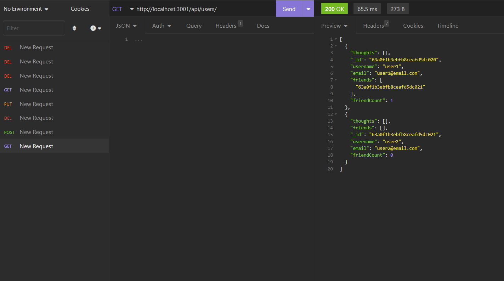

# social-network-API

## Description

This application provides routes for viewing, posting, updating, and deleting data in a database for a social network
allows a user to view posts by other users and comment on them and create his own when logged in

## Installation

This application requires node.js and MongoDB. Open the root folder containing "index.js" of the application in a terminal and enter "npm install".

## Usage

To seed the database, open the root folder containing "index.js" in a terminal and enter "npm run seed". To run this on a local host, enter "npm start". Use Insomnia to make HTTP requests using the routes in the routes/api folder.

https://github.com/BrendanShelton/social-network-API

## Technologies used

Javascript, Node.js, Express, MongoDB, Mongoose  

## Credits

N/A

## License

MIT License

Copyright (c) 2022 BrendanShelton

Permission is hereby granted, free of charge, to any person obtaining a copy
of this software and associated documentation files (the "Software"), to deal
in the Software without restriction, including without limitation the rights
to use, copy, modify, merge, publish, distribute, sublicense, and/or sell
copies of the Software, and to permit persons to whom the Software is
furnished to do so, subject to the following conditions:

The above copyright notice and this permission notice shall be included in all
copies or substantial portions of the Software.

THE SOFTWARE IS PROVIDED "AS IS", WITHOUT WARRANTY OF ANY KIND, EXPRESS OR
IMPLIED, INCLUDING BUT NOT LIMITED TO THE WARRANTIES OF MERCHANTABILITY,
FITNESS FOR A PARTICULAR PURPOSE AND NONINFRINGEMENT. IN NO EVENT SHALL THE
AUTHORS OR COPYRIGHT HOLDERS BE LIABLE FOR ANY CLAIM, DAMAGES OR OTHER
LIABILITY, WHETHER IN AN ACTION OF CONTRACT, TORT OR OTHERWISE, ARISING FROM,
OUT OF OR IN CONNECTION WITH THE SOFTWARE OR THE USE OR OTHER DEALINGS IN THE
SOFTWARE.